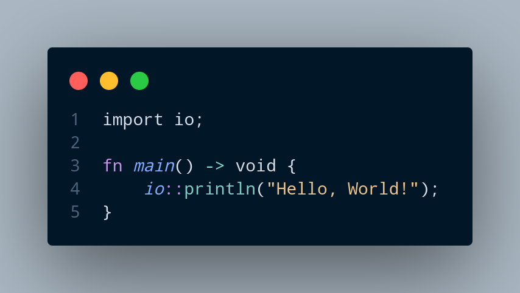

# The X-Compiler

<h2 style="text-align: center;">https://x-compiler.com</h2>

This is a revamped version of the [old XY Compiler](https://github.com/joshuawills/XY-Compiler) that I decided to 
rewrite after learning more formal compiler development theory.

The language is a mix of C and Rust syntax, taking features I like from both.

At the moment the language is quite primitive. However, it has a strong foundation, and I have a clear vision
of where to take it. Around 70% of compilation time is currently delegated to Clang's backend work on my
LLVM output. A significant future improvement I am considering is a port over to generating native assembly code, x86_64 
to start with. However, I will continue generating LLVM IR for the time being given its simplicity.